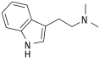

#DMT

**IUPAC** 2-(1H-Indol-3-yl)-N,N-dimethylethanamine

**CAS** 61-50-7

**The psychotropic effects of DMT were studied scientifically by Stephen Szára in clinical studies performed in the 1950s**

>I was joined by three other psychiatrists András Sai-Halász, Zoltán Böszörményi, and Györgyi Brunecker who helped me to recruit, and test
about 30 volunteers. In agreement with my coworkers, I sent in a short, preliminary report to the Swiss journal Experientia in the summer of 1956
before the Hungarian Revolution happened (Szára, 1956). The full reports appeared only two years later (Sai-Halász, Brunecker and Szára, 1958; Böszörményi and Szára, 1958).

>The effects of a medium effective dose (0.7 mg/kg) given  intramuscularly, were similar to those of mescaline and LSD: visual illusions and hallucinations, distortion of body image, speech disturbances, and mood changes: euphoria or anxiety (depending on set
and setting). The most remarkable aspect of the effects was the rapid onset (2-5 minutes) and short duration (30-60 minutes). These effects have been replicated by a number of independent groups of investigators (Turner and Merlis 1959; Rosenberg et al 1963; Gillin et al, 1976; Strassman et al 1994).

*DMT at Fifty*  
Stephen Szára (2007) *Neuropsychopharmacologia Hungarica* **IX/4**: 201-205

&nbsp;

#5-MeO-DMT

**IUPAC** 2-(5-Methoxy-1H-indol-3-yl)-N,N-dimethylethanamine

**CAS** 1019-45-0

**It was known no later than 1959 that 5-MeO-DMT is a natural product found in the bark of *Dictyoloma incanescens***

>The bark of the Brazilian tree *Dictyoloma incanescens* D.C. yielded a new alkaloid, N,N-dimethyl-5-methoxytryptamine

*Indole alkaloids of* Acer saccharinum *(the Silver Maple),* Dictyoloma incanescens*,* Piptadenia colubrina*, and* Mimosa hostilis  
Pachter IJ, Zacharias DE, Ribeiro O (1959) *J Org Chem*  **24**:1285–1287

&nbsp;

**Hoshino and Shimodaira reported synthesis of 5-MeO-DMT in 1936**

*ÜBER DIE SYNTHESE DES BUFOTENIN-METHYL-ÄTHERS (5-METHOXY-N-DIMETHYL-TRYPTAMIN) UND BUFOTENINS (SYNTHESEN IN DER INDOL-GRUPPE. XV)*  

*ABOUT THE SYNTHESIS OF BUFOTENIN METHYL ETHER (5-METHOXY-N-DIMETHYL-TRYPTAMINE) AND BUFOTENIN (SYNTHESIS IN THE INDOL GROUP. XV)*  
Hoshino T, Shimodaira K (1936) *Bull Chem Soc Japan* **11**: 221; Chem Abstr (1936) **30**: 5982

