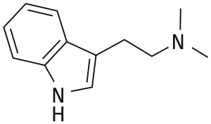

#DMT

**IUPAC** 2-(1H-Indol-3-yl)-N,N-dimethylethanamine

**CAS** 61-50-7

 

#5-MeO-DMT

**IUPAC** 2-(5-Methoxy-1H-indol-3-yl)-N,N-dimethylethanamine

**CAS** 1019-45-0

**It has been known since 1959 that 5-MeO-DMT is produced in the bark of *Dictyoloma incanescens***

>The bark of the Brazilian tree *Dictyoloma incanescens* D.C. yielded a new alkaloid, N,N-dimethyl-5-methoxytryptamine

*Indole alkaloids of* Acer saccharinum *(the Silver Maple),* Dictyoloma incanescens*,* Piptadenia colubrina*, and* Mimosa hostilis
Pachter IJ, Zacharias DE, Ribeiro O
*J Org Chem* (1959) **24**:1285–1287

 

**Hoshino and Shimodaira reported synthesis of 5-MeO-DMT in 1936**

Hoshino T, Shimodaira K *Bull Chem Soc Japan* (1936) **11**: 221; Chem Abstr (1936) **30**: 5982
