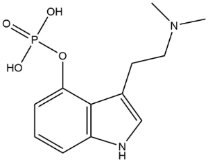
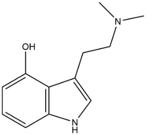

#psilocybin

**IUPAC** [3-(2-Dimethylaminoethyl)-1H-indol-4-yl] dihydrogen phosphate

**CAS** 520-52-5

#psilocin

**IUPAC** 3-[2-(Dimethylamino)ethyl]-1H-indol-4-ol

**CAS** 	
520-53-6

&nbsp;

**Psilocybin has been known as a natural product produced by mushrooms from the genus *Psilicybe* since no later than 1958**

*Psilocybin, a psychotropic substance from the Mexican mushroom* Psilicybe mexicana  
Hofmann A, Heim R, Brack A, Kobel H *Experientia* (1958) **14**: 107-9 [PubMed](https://pubmed.ncbi.nlm.nih.gov/13537892/)

&nbsp;

**Psilocybin is produced by multiple genera of mushrooms, where it is present in amounts of approximately 1% by dry weight**  

*Psilocybin and psilocin levels in twenty species from seven genera of wild mushrooms in the Pacific Northwest, USA*  
Beug MW, Bigwood J (1982) *J Ethnopharmacol* **5**: 271–85.  

&nbsp;

**Total synthesis of psilocybin and confirmation of the psilocybin structure was accomplished in 1958**  

*Elucidation of the structure and the synthesis of psilocybin*  
Hofmann A, Frey A, Ott H, Petrzilka T, Troxler F. (1958) *Experientia* **14**: 397–99 [PubMed](https://pubmed.ncbi.nlm.nih.gov/13609599/)

&nbsp;

**Sherwood reported an improved, scalable synthesis of psilocybin**
>Described herein is an improved synthesis of 3-[2-(dimethylamino)ethyl]-1H-indol-4-yl dihydrogen phosphate (psilocybin). The protocol outlines: synthesis of multigram quantities of psilocybin, identification of critical in-process parameters, and isolation of psilocybin without the use of chromatography, TLC, or aqueous workup. The synthesis furnishes psilocybin in five steps in 23% overall yield from an inexpensive acetoxyindole starting material. With specific focus on process control and impurity fate and removal, the improved procedure is amenable to providing high-quality psilocybin.

*An improved, practical, and scalable five-step synthesis of psilocybin*  
Sherwood A, Meisenheimer P, Tarpley G, Kargbo R (2020) *Synthesis* **52**: 688–94

&nbsp;

**Psilocybin has been consumed by humans**
>Systematic examination of its action on human subjects was carried out by volunteers in Basle during 1959

*Psilocybin, Its History and Pharmacology*  
(1960) *Can Med Assoc J* **82**(18): 936 [PubMed](https://www.ncbi.nlm.nih.gov/pmc/articles/PMC1938103/)

&nbsp;

**A typical oral dose of *Psilocybe mexicana* is approximately 2 g of dried mushrooms, which provides approximately 4–8 mg of psilocybin**  

*Teonanacatl and Ololiuqui, two ancient magic drugs of Mexico*  
Hofmann A. (1971) *Bull Narc* **XXIII**: 3–14 [United Nations Office on Drugs and Crime](https://www.unodc.org/unodc/en/data-and-analysis/bulletin/bulletin_1971-01-01_1_page003.html)

&nbsp;

**Milligram doses of psilocybin have effects on humans**
>Small doses of a few milligrams produce within 20 to 30 minutes both somatic and mental changes. The somatic effects are mainly neurovegetative, such as mydriasis, hyperreflexia, hypertension or hypotension, changed pulse frequency, etc. In small doses the drug produces a change in mood and in contact with the environment which is subjectively pleasant and consists of relaxation and detachment from the outside world. In higher doses, changes in orientation and psychosensory phenomena develop, such as visual hypernesthesia, illusions and hallucinations. They are, however, not as frequent as those following lysergic acid-diethylamide and especially following mescaline.

*Psilocybin, Its History and Pharmacology*  
(1960) *Can Med Assoc J* **82**(18): 936 [PubMed](https://www.ncbi.nlm.nih.gov/pmc/articles/PMC1938103/)

&nbsp;

**Psilocybin is dephosporylated in vivo to form the bioactive product psilocin**

*The enzymic dephosphorylation and oxidation of psilocybin and psilocin by mammalian tissue homogenates*  
Horita A, Weber LJ (1961) *Biochem Pharmacol* **7**: 47–54 [PubMed](https://pubmed.ncbi.nlm.nih.gov/13715852/)

*Some biochemical studies on psilocybin and psilocin*  
Horita A. (1963) *J Neuropsychiatry* **4**: 270 [PubMed](https://pubmed.ncbi.nlm.nih.gov/13954906/)

*Determination of psilocin and 4-hydroxyindole-3-acetic acid in plasma by HPLC-ECD and pharmacokinetic profiles of oral and intravenous psilocybin in man*  
Hasler F, Bourquin D, Brenneisen R, Bar T, Vollenweider FX (1997) *Pharm Acta Helv* **72**: 175–84 [PubMed](https://pubmed.ncbi.nlm.nih.gov/9204776/)

&nbsp;

**Psilocin targets serotonin 5-HT2A receptors**  
*Psychedelics*  
Nichols DE (2016) *Pharm Rev* **68**: 264–355

&nbsp;

**Psilocybin has been used as a treatment for mental disorders**
>Delay and co-workers have recently reported the therapeutic effect of psilocybin in a compulsion neurosis.

*Psilocybin, Its History and Pharmacology*  
(1960) *Can Med Assoc J* **82**(18): 936, [PubMed](https://www.ncbi.nlm.nih.gov/pmc/articles/PMC1938103/)

&nbsp;

**Many peer reviewed studies of psilocybin chemistry and biological effects have been published over the past several decades**  

>Since 1980 ... there have been about 200 published reports focused on various aspects of psilocybin pharmacology, chemistry, and biochemistry as well as careful studies in humans. Starting in 1996 and up to the present time, increasing numbers of reports have appeared of studies of the effects of psilocybin on human perception, emotion, and psychopharmacology. Among those are 112 reported studies of psilocybin in humans, including recent therapeutic trials in depression, anxiety, and substance use disorders  

*Psilocybin: from ancient magic to modern medicine*  
Nichols DE (2020) *J Antibiot (Tokyo)* **73**: 679–86

&nbsp;

**One of ordinary skill in the art would have been motivated to administer psilocybin for therapy**
>There may be some advantages to therapy with this drug as compared with lysergic acid-diethylamide, whose prolonged action and consequent production of anxiety are a well-known deterrent to its widespread use. Cerletti expresses the hope that clinical investigation combined with biochemical clarification of the connection between psilocybin and endogenous metabolism of indol will succeed in removing the mystery from these small mushrooms with their traditional magic action.

*Psilocybin, Its History and Pharmacology*  
(1960) *Can Med Assoc J* **82**(18): 936, [PubMed](https://www.ncbi.nlm.nih.gov/pmc/articles/PMC1938103/)

